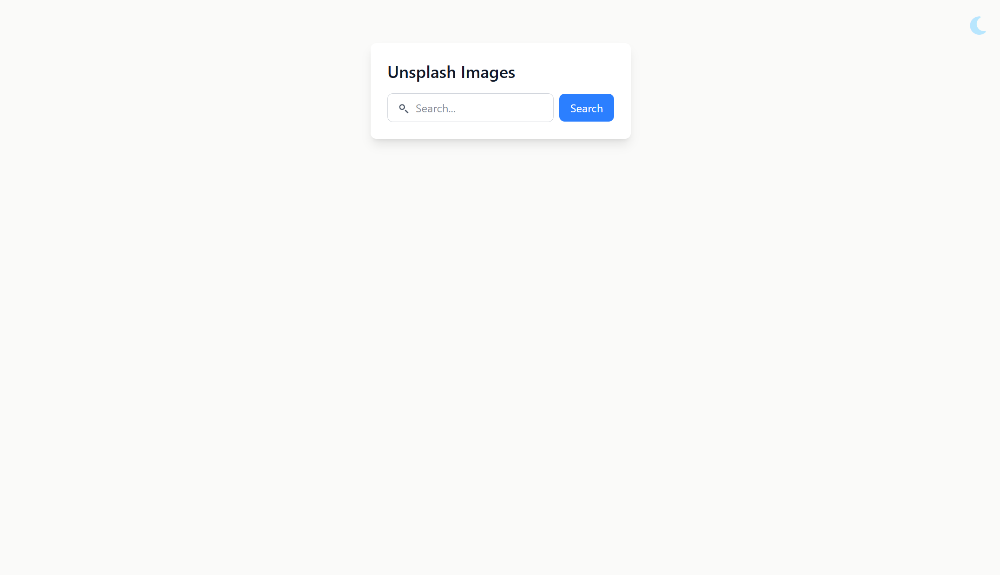
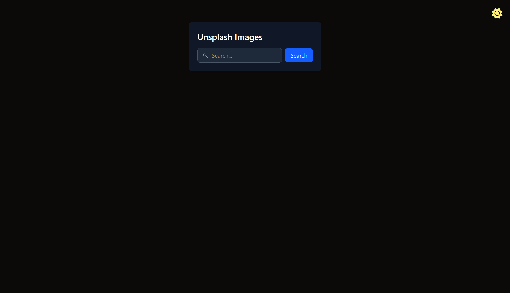
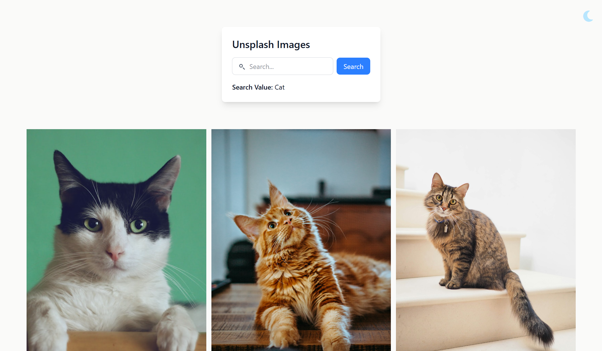
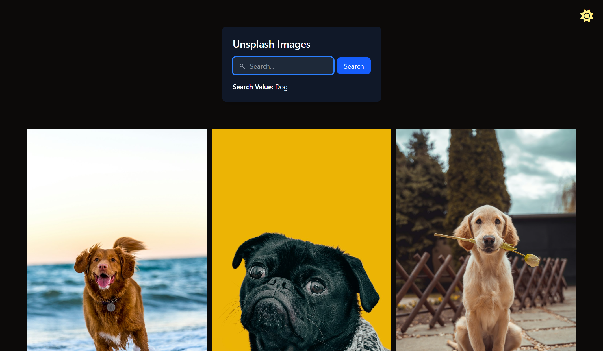

# Unsplash Image Search Project

This project is built using **React, React Context API, Unsplash API, TypeScript, and Tailwind CSS**.

## 📌 Project Purpose

The main goal of this project is to **fetch images from the Unsplash API** dynamically based on user input. Users can search for any keyword, and the application retrieves and displays relevant images.

## 🚀 Features

- **Search Functionality**: Users can enter any keyword to search for images.
- **Unsplash API Integration**: Fetches images dynamically based on user queries.
- **Light/Dark Mode**: Toggle between light and dark themes.
- **React Context API**: Manages global state efficiently.
- **TypeScript Support**: Ensures type safety and maintainability.
- **Responsive Design**: Built with **Tailwind CSS** for a modern and responsive layout.

## 📂 How It Works

1. Users **enter a search query** in the input field.
2. The app makes a request to the **Unsplash API** to fetch matching images.
3. Retrieved images are displayed in a responsive grid format.
4. Users can toggle between **light and dark modes**.

## 🔗 Live Demo

You can review the app **[here](https://unsplash-ack.netlify.app/)**.

## 🖼️ Screenshots

### 🔍 Search Results - Dark Mode

### 🔍 Search Results - Light Mode

### 🌙 Dark Mode - No Search Query

### ☀️ Light Mode - No Search Query

---

### 🛠️ Technologies Used

- **React** - Component-based UI development
- **React Context API** - State management across components
- **Unsplash API** - Fetching high-quality images dynamically
- **TypeScript** - Static typing and better code maintainability
- **Tailwind CSS** - Utility-first styling for responsive design

Feel free to explore the project and let me know your thoughts! 🚀
